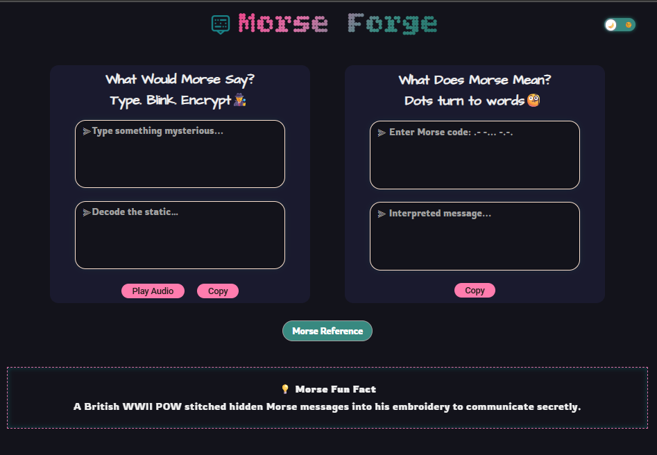

# Morse Forge 🔐

Morse Forge is a lightweight, interactive web tool for encoding and decoding Morse code. It provides real-time translation, audio beeping, and a visually enhanced UI with light/dark theme support.

---

## 🔗 Live Demo

👉 [https://morse-forge.vercel.app](https://morse-forge.vercel.app)

---

## 🚀 Features

- 🔁 **Live Encoder & Decoder**: Convert text to Morse and vice versa instantly.
- 🔊 **Morse Audio Playback**: Hear your Morse output as beeps with visual highlights.
- 🌓 **Theme Toggle**: Switch between light and dark mode; remembers your preference.
- 📋 **One-Click Copy**: Copy encoded or decoded text to clipboard easily.
- 💡 **Daily Morse Fact**: Displays a different fun Morse code fact each day.
- 📘 **Reference Table**: Quick access to full Morse code symbol reference.

---

## 🛠 Tech Stack

- **React** (Functional Components + Hooks)
- **CSS3** (Custom properties, animations, media queries)
- **React Router** (for page routing)
- **JavaScript** (for encoding, decoding, and logic)

---

## 📎 How to Run (Vite)

```bash
npm install
npm run dev
```

 🖼️ Preview

Here's a quick look at Morse Forge in action:


